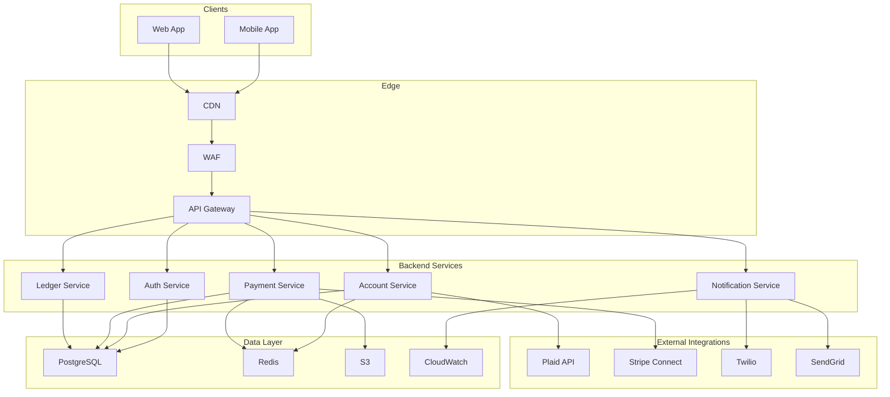

# 01 - System Architecture

## Objective
Understand the PayFlow system architecture before identifying threats. You can't secure what you don't understand.

## System Overview

PayFlow consists of several key components:

### Frontend Layer
- **Web Application** (React SPA)
  - User authentication UI
  - Dashboard for account management
  - Transaction history view
  - Payment initiation forms
  
- **Mobile Apps** (iOS/Android)
  - Native apps with similar functionality
  - Biometric authentication support
  - Push notifications

### Backend Services (Microservices Architecture)

- **API Gateway** (Kong/AWS API Gateway)
  - Rate limiting
  - Authentication/Authorization
  - Request routing
  
- **Auth Service**
  - User registration/login
  - JWT token issuance
  - MFA handling
  - Session management
  
- **Account Service**
  - User profile management
  - Bank account linking (via Plaid API)
  - Balance tracking
  
- **Payment Service**
  - Transaction processing
  - Payment validation
  - Fraud detection hooks
  
- **Notification Service**
  - Email notifications
  - SMS alerts
  - Push notifications

- **Ledger Service**
  - Double-entry bookkeeping
  - Transaction recording
  - Balance calculations

### Data Layer

- **PostgreSQL Database**
  - User accounts
  - Transaction records
  - Audit logs
  
- **Redis Cache**
  - Session storage
  - Rate limiting counters
  - Temporary data

### External Integrations

- **Plaid API** - Bank account verification and linking
- **Stripe Connect** - Payment processing
- **Twilio** - SMS delivery
- **SendGrid** - Email delivery
- **AWS S3** - Document storage (ID verification)

### Infrastructure

- Hosted on AWS (EKS for containers)
- CloudFront CDN for static assets
- WAF for DDoS protection
- CloudWatch for logging and monitoring

## Architecture Diagram



## TODO: System Architecture Analysis

### TODO 1: Identify Components
List all the components you see in the architecture above. For each, note:
- What it does
- What sensitive data it handles
- Who/what can access it

Example:
```
Component: Auth Service
Purpose: Handles user authentication and authorization
Sensitive Data: Passwords, tokens, MFA secrets
Access: API Gateway, direct service-to-service calls
```

**Your Answer:**
```
Component: Mobile App
Purpose: Native iOS/Android app for account management, payments, and biometric authentication with push notifications
Sensitive Data: Biometric templates, JWT tokens, refresh tokens, personal/financial info
Access: End users via device; communicates with API Gateway (public internet)

Component: Web App
Purpose: React SPA for user authentication, dashboard, transaction history, and payment initiation
Sensitive Data: JWT tokens, refresh tokens, personal/financial info
Access: End user browsers; communicates with API Gateway (public internet)

Component: API Gateway
Purpose: Single entry point for client requests; validates, authenticates, authorizes, rate limits, and routes to appropriate backend services
Sensitive Data: JWT tokens, user credentials (during auth), financial data in request bodies, service API keys
Access: Mobile App, Web App (public internet); all backend services (internal network); sits behind WAF/CDN

Component: Auth Service
Purpose: 
Sensitive Data: 
Access: 

Component: Account Service
Purpose: 
Sensitive Data: 
Access: 

Component: Payment Service
Purpose: 
Sensitive Data: 
Access: 

Component: Notification Service
Purpose: 
Sensitive Data: 
Access: 

Component: Ledger Service
Purpose: 
Sensitive Data: 
Access: 

Component: PostgreSQL Database
Purpose: 
Sensitive Data: 
Access: 

Component: Redis Cache
Purpose: 
Sensitive Data: 
Access: 

Component: S3 Storage
Purpose: 
Sensitive Data: 
Access: 

Component: External APIs (Plaid, Stripe, Twilio, SendGrid)
Purpose: 
Sensitive Data: 
Access: 


```

### TODO 2: Map Network Boundaries
Identify the network boundaries in this system:
- What's on the public internet?
- What's in the trusted internal network?
- What external services do we depend on?

**Your Answer:**
```
Public Internet:


Internal/Private Network:


External Dependencies:


```

### TODO 3: Identify Single Points of Failure
What components, if compromised, would be catastrophic? Why?

**Your Answer:**
```
Critical Components:
1.

2.

3.


```

### TODO 4: Data Classification
Classify the types of data this system handles:
- Public
- Internal
- Confidential
- Restricted (PII, financial)

**Your Answer:**
```
Public Data:


Internal Data:


Confidential Data:


Restricted/Sensitive Data:


```

### TODO 5: Authentication and Authorization Flows
Describe how you think authentication works:
- How does a user log in?
- How are subsequent requests authenticated?
- How does service-to-service auth work?

**Your Answer:**
```
User Login Flow:


Request Authentication:


Service-to-Service:


```

## Key Questions to Consider

Before moving to the next file, make sure you can answer:
- Could you explain this system to someone else?
- Do you understand how money flows through the system?
- Do you know where sensitive data is stored?
- Can you identify the external attack surface?

## Next Steps

Once you've completed all TODOs, proceed to `02-assets-and-trust-boundaries.md`
